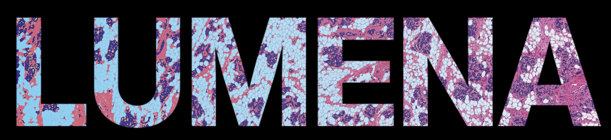

# LUMENA Toolkit

Welcome to the LUMENA toolkit for quantifying H&E-stained mammary gland tissues. This toolkit includes a pixel classifier and batch analysis script to use in QuPath for quantifying the extra cellular matrix, epithelial, intralumenal content, and adipose tissue components in H&E stained mammary gland tissue sections. The toolkit also includes a registration pipeline to reassemble large tissues to a common coordinate system.

*At present, the current version of LUMENA does require using QuPath and Python (with user generated keys and reference points) to leverage the entire toolkit, future directions include streamlining.*

## LUMENA pixel classifier (QuPath)

The pixel classifiers and batch analysis script for LUMENA work with [QuPath v6.0](https://github.com/qupath/qupath/releases/tag/v0.6.0). The classifiers are likely to work with QuPath v7.0 but have not been tested yet.

### How to use LUMENA in your QuPath project

Install QuPath using the link above. After creating a QuPath project, download and extract [LUMENA_pixel_classifiers.zip](/LUMENA_pixel_classifiers.zip). Place `LUMENA_pixel_classifier.json` into the pixel classifier folder `QuPath_project/classifiers/pixel_classifiers` and the `Run_LUMENA.groovy` and `Run_LUMENA_TILES.groovy` scripts into the scripts folder `QuPath_project/scripts` (create the scripts folder if it does not already exist).

After adding in the H&E-stained tissues, create annotation outlines for all tissues to be analyzed. We used the [QuPath plugin SAM](https://github.com/ksugar/qupath-extension-sam) with [GPU acceleration](https://github.com/ksugar/samapi) for creating the outlines, but a simple threshold based classifier could work as well depending on the tissues.

To only get whole tissue measurements from LUMENA, open `Run_LUMENA.groovy` and run as a batch on the desired images in your project.

To create tiles with classifications, open the `Run_LUMENA_TILES.groovy` script and run as a batch on the desired images in your project.

Details on running scripts in batch within QuPath projects can be found in the official [QuPath documentation](https://qupath.readthedocs.io/en/0.6/).

## Tissue reconstruction for LUMENA

Due to the large size of lactating mammary glands, imaging sections from these tissues using slide scanners requires cutting the samples into smaller regions. We created a pipeline to reconstruct these regions leveraging reference maps and the python package [Simple-ITK](https://simpleitk.org/).

Cardinal point references for East (medial) and North (dorsal) need to be added for each tissue in the QuPath project. These will be exported with the tissue masks and used as reference points in the reconstruction pipeline. Use the centroid script to mark the centroid of each tissue annotation and a rectangle annotation with interactive transform to aid in placing the Each and North points perpendicularly.

### Requirements for tissue reconstruction

Successful reconstruction first starts with keeping a reference of how the tissues were cut into smaller regions and their orientation when placed on the slide. Data frames containing these metadata are required along with reference maps of the region layouts.

LUMENA reconstruction assumes there is an exported data frame generated from using LUMENA Tiles in QuPath containing the X,Y coordinates of the tiles along with relevant measurements from the analysis and metadata for appropriate grouping.

More details can be found in the [LUMENA reconstruction folder](LUMENA_Reconstruction).

Currently, LUMENA reconstruction does not run in parallel, but some of the processes of SimpleITK take advantage of multithread processing. We recommend 32 GBs of RAM or greater for optimal speed. In recent pipeline runs, a batch of ~475 images (accounting for 118 glands) was processed in less than 20 minutes using an HPC node with a minimum of 40 cores and 128 GBs RAM.

## Citation

If you use LUMENA in your publication, kindly this GitHub repository, [QuPath](https://qupath.readthedocs.io/en/0.6/docs/intro/citing.html), and any other extensions used.
